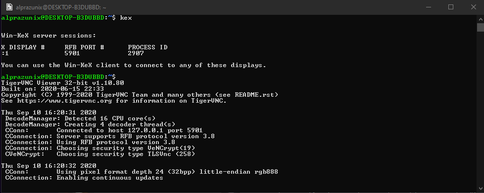
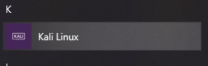

# Kali Linux
<p align="center">
    
</p>

Antes de começar, o Kali Linux no WSL 2 __NÃO__ inclui as
ferramentas para pentest, hacking, etc. Entretanto, quando for instalado o Win-Kex, será instalado as ferramentas junto. Então casos não seja do seu interese essas ferramentas, eu sugiro usar outra distribuição linux.

Bem, para fazer a instalação do Win-Kex rodamos o comando:

```
sudo apt update && sudo apt install kali-win-kex 
```
Que vai atualizar o linux e instalar o Kali-win-kex, terminando de instalar,
é só rodar o comando `kex` que já vai inicar a interface do Kali.

<p align="center">
    
</p>

____

>É bom lembrar que (pelo menos até a onde eu testei.) o Win-Kex só funciona corretamente, quando você usa o terminal que aparece quando inicia pelo "icone" da distribuição

<p align="center">
    
</p>

____

E tcharam, está configurado o seu Kali pelo WSL2, ele ficará mais ou menos assim:

<p align="center">
    
</p>

> caso queira o wallpaper pro kali, é só fazer o download do arquivo: [link](../../assets/kalihe4rt.png)