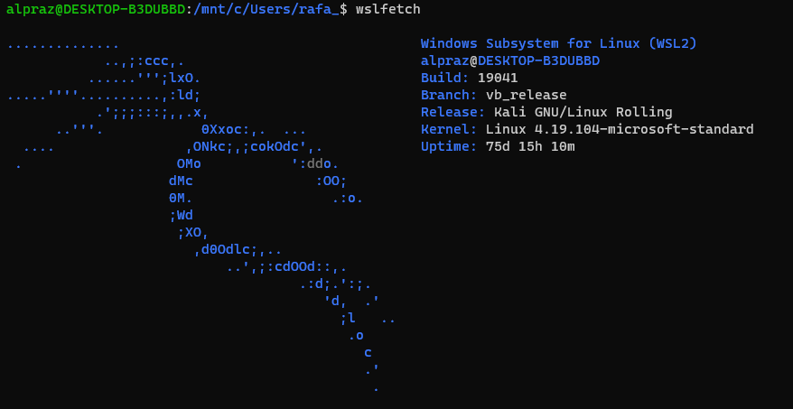
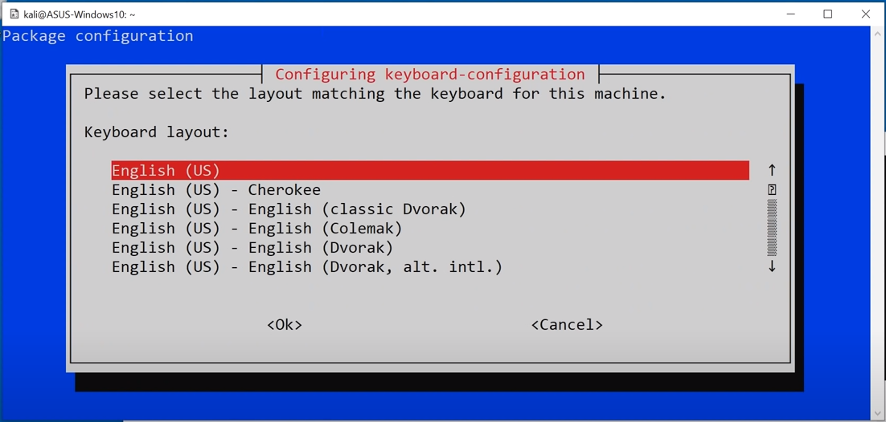
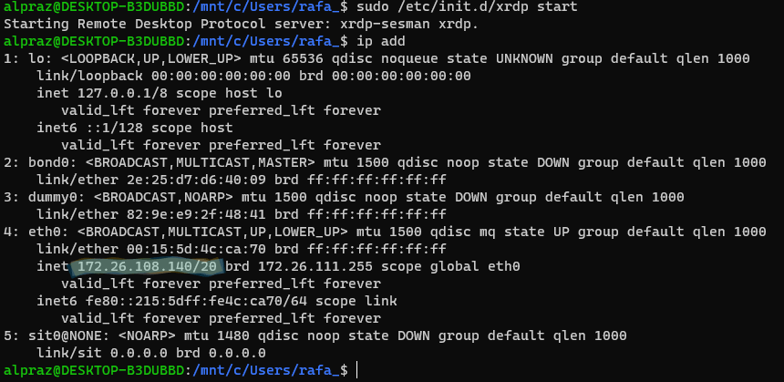
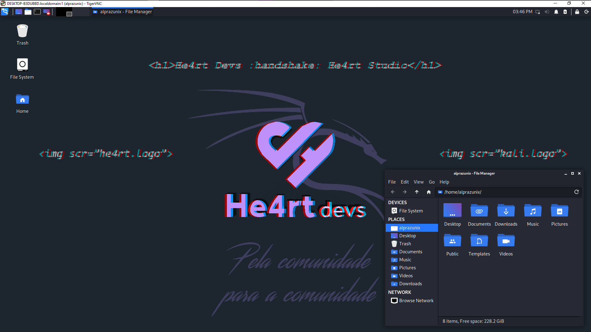

# Kali Linux

    

Bem, antes, eu queria só lembrar que o Kali linux no WSL 2 __NÃO__ vem com as
ferramentas para pentest, hacking, etc.

Sabendo disso, iremos intalar a interface `xfce4`, que é uma inteface do linux simples, assim não pesando tanto no seu pc. Bem, para isso usamos o comando:

`sudo apt install xfce4`

Quando estive instalado, vai aparecer a seguinte tela no terminal. Nisso, você vai pra ultima opção "anothers" que vai aparecer outros idiomas, depois é só selecionar o idioma e o tipo do teclado.

    

Como o xfce instalado, a gente vai instalar o xrdp:

`sudo apt install xrdp`

O xrdp é o que vai permitir a gente ter a interface, já que o que ele
fazer é permitir que você use o "computador linux" com o acesso remoto.

Então, após instalar, a gente vai iniciar o xrdp como o comando:
`sudo /etc/init.d/xrdp start`
e em seguida vamos ver qual o ip do kali pra poder executa-lo com o comando:
`ip add`. Na onde está marcado, é onde estará o seu ip.

    

Feito isso, você vai procurar "acesso remoto" na barra de pesquisa do windows, nele, você vai passar o ip do seu kali e com isso acessar. Ao acessar, vai aparecer um tela que vai pedir pra você colocar o usario e senha do seu Kali e pronto, agora temos um interface grafica pro Kali no WSL!

    

