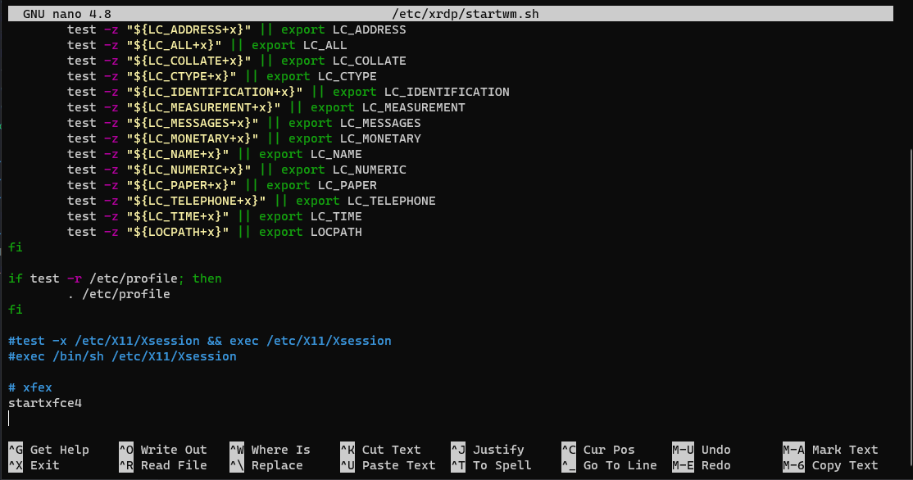

# Ubuntu

Primeiro vamos rodar o seguinte codigo:
`sudo apt update && sudo apt -y update` para termos tudo atualizado no linux

Bem feito isso, iremos instalar a inteface xfce por ser mais leve e não pesar muito pro seu computador, para isso, vamos usar o comando:

`sudo apt install xfce4`

Depois, vamos instalar o xrdp. Pois é ele que vai permitir a gente ter a interface, já que o que o mesmo fazer é permitir que você use o "computador linux" com o acesso remoto.

`sudo apt install xrdp`

como o xrdp instalado, executamos os seguintes comandos para fazer a configuração do xrdp:

`sudo cp /etc/xrdp/xrdp.ini /etc/xrdp/xrdp.ini.bak`
>aqui ele cria um backup do arquivo de configuração do xrdp

`sudo sed -i 's/3389/3390/g' /etc/xrdp/xrdp.ini`
> ele vai mudar a porta padrão de 3389 para 3390, para não ter um conflito de portas

`sudo sed -i 's/max_bpp=32/#max_bpp=32\nmax_bpp=128/g' /etc/xrdp/xrdp.ini`
>Aumenta a resolução

`sudo sed -i 's/xserverbpp=24/#xserverbpp=24\nxserverbpp=128/g' /etc/xrdp/xrdp.ini `
> e aumenta o Bits Per Pixel, bpp. Esses dois comandos aumentam a qualidade da seção do xrdp

` echo xfce4-session > ~/.xsession `
> e por fim salvamos isso no xsession

Depois editamos o arquivo startwm.sh usando o nano.

`sudo nano /etc/xrdp/startwm.sh`

Ai você vai comentar as linhas 

```
#test -x /etc/X11/Xsession && exec /etc/X11/Xsession
#exec /bin/sh /etc/X11/Xsession
```

e depois vai adicionar as linha:

```
#xfce
startxfce4
```

ficando assim

<p align="center" width=50%>
    
</p>

Agora a gente roda o codgio:

`sudo /etc/init.d/xrdp start`

Que vai abrir o servidor pra você poder acessar remotamente.

Feito isso, você vai procurar "acesso remoto" na barra de pesquisa do windows, nele, você passa `localhost:3390` e com isso acessar. Ao acessar, vai aparecer um tela que vai pedir pra você colocar o usario e senha do seu Ubuntu e pronto, agora temos um interface grafica pro Ubuntu no WSL!