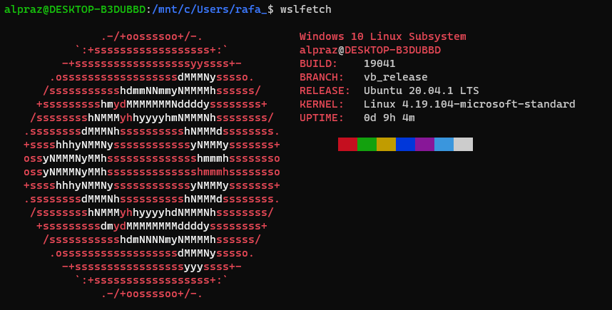
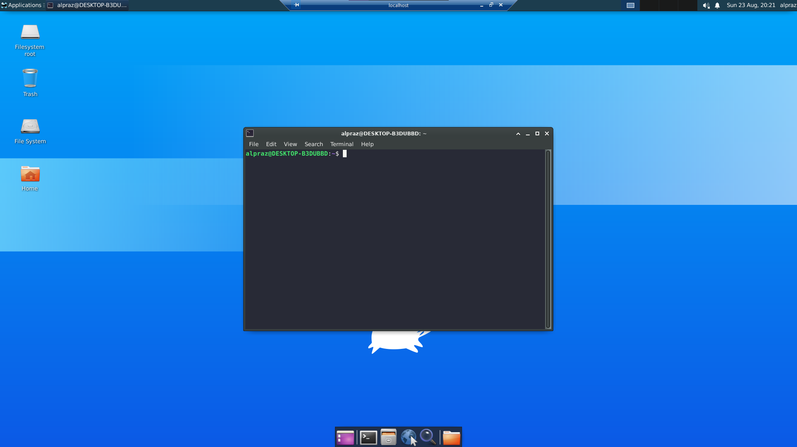

# Ubuntu
<p align="center">
    
</p>

Primeiro vamos rodar o seguinte codigo:
`sudo apt update && sudo apt -y update` para termos tudo atualizado no linux.

Bem feito isso, iremos instalar a inteface **xfce** por ser mais leve e não pesar muito para o seu computador. Para isso, vamos usar o comando:

`sudo apt install xfce4`

Depois, vamos instalar o xrdp. Pois é ele que vai permitir o uso da interface gráfica, já que o que o mesmo fazer é permitir que você use o "computador linux" com o acesso remoto.

`sudo apt install xrdp`

Com o xrdp instalado, executamos os seguintes comandos para fazer a configuração do xrdp:

`sudo cp /etc/xrdp/xrdp.ini /etc/xrdp/xrdp.ini.bak`
> Cria um backup do arquivo de configuração do xrdp

`sudo sed -i 's/3389/3390/g' /etc/xrdp/xrdp.ini`
> Mudar a porta padrão de 3389 para 3390, para não ter um conflito de portas

`sudo sed -i 's/max_bpp=32/#max_bpp=32\nmax_bpp=128/g' /etc/xrdp/xrdp.ini`
> Aumenta a resolução

`sudo sed -i 's/xserverbpp=24/#xserverbpp=24\nxserverbpp=128/g' /etc/xrdp/xrdp.ini `
> Aumenta o Bits Per Pixel, bpp. Esses dois comandos aumentam a qualidade da seção do xrdp

` echo xfce4-session > ~/.xsession `
> E, por fim, salvamos isso no xsession

Depois editamos o arquivo startwm.sh usando o nano.

`sudo nano /etc/xrdp/startwm.sh`

Comente as linhas utilizando `#`.

```
#test -x /etc/X11/Xsession && exec /etc/X11/Xsession
#exec /bin/sh /etc/X11/Xsession
```

E adicione as linhas:

```
#xfce
startxfce4
```

Ficando assim:

<p align="center">
    
</p>

Agora, execute o código:

`sudo /etc/init.d/xrdp start`

Que abrirá o servidor para poder acessar remotamente.

Depois de ter feito todos os passo anteriores, procure por "acesso remoto" na barra de pesquisa do Windows. Nele, insira `localhost:3390` para poder acessar. Ao acessar, vai aparecer um tela que vai pedir pra você colocar o usuário e senha do seu Ubuntu. Pronto, agora temos um interface gráfica para o Ubuntu no WSL!

<p align="center">
    
</p>