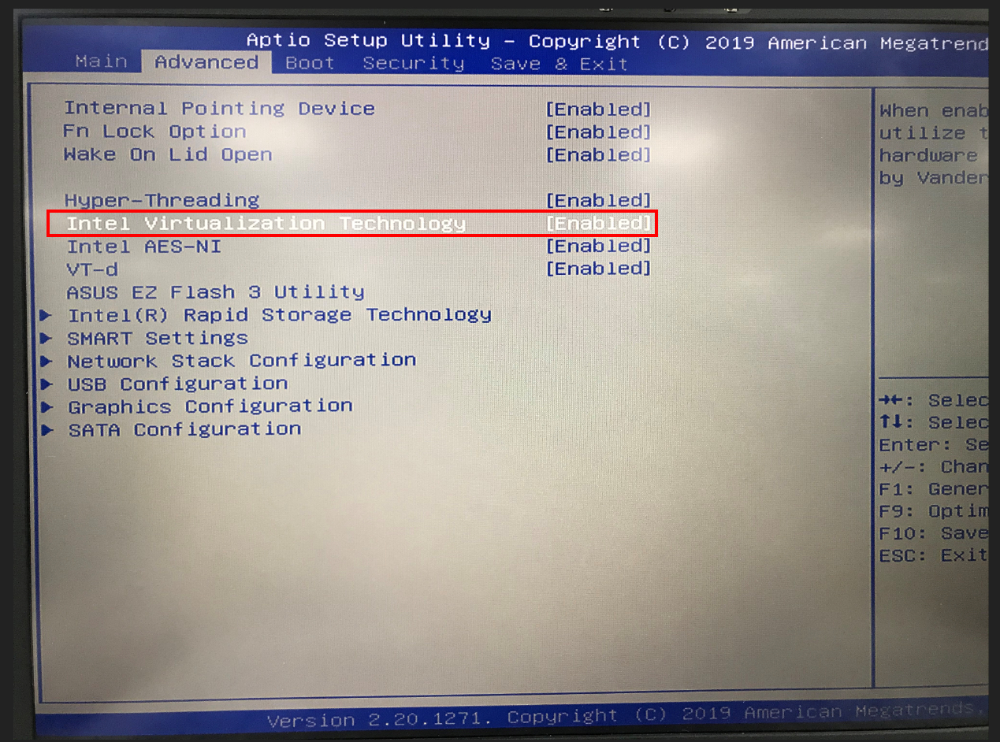
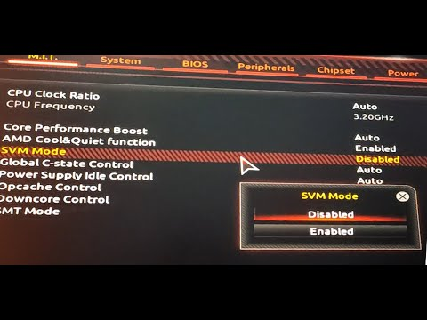
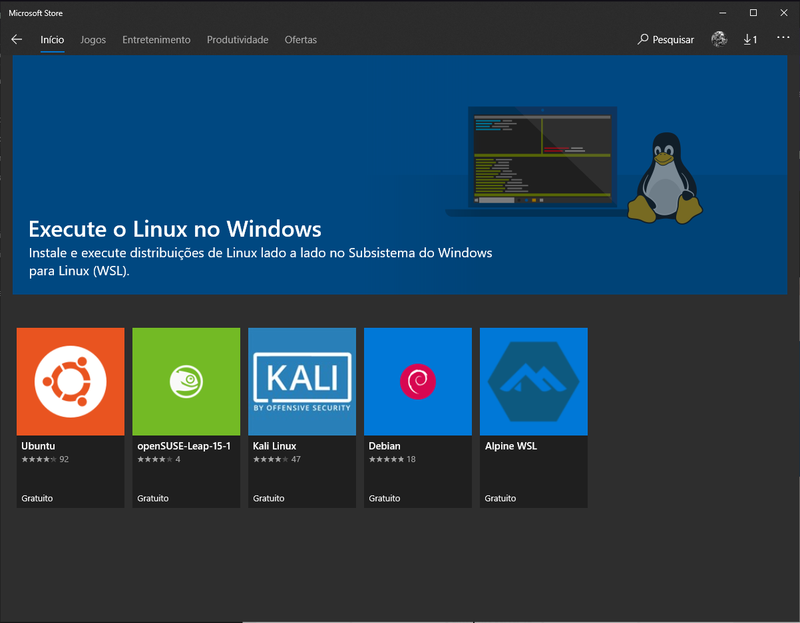
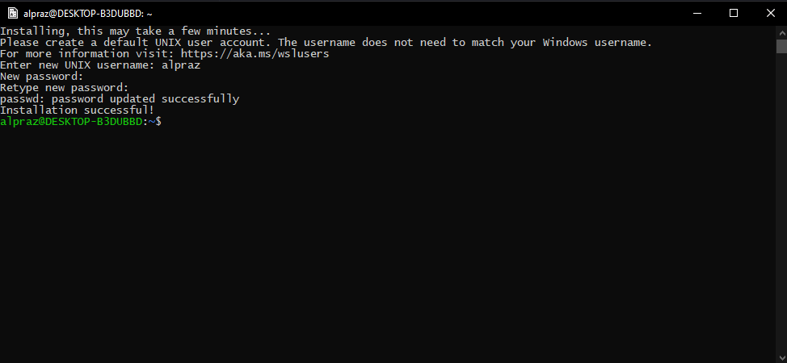

# WSL - Windows Subsystem for Linux

    

# Sobre

O WSL é um recurso para windows que permite executar inários e scripts em Linux diretamente no Windows, basicamete, seria rodar o linux dentro do windows, só que sem a interface gráfica.

Ele é uma boa alternativa pra quem não quer fazer dual boot com o linux ou que não quer ficar criando um ambiente separado com uma virtual machine, ou também pra poder algo que não conseguiu instalar no windows por exempro.

Atualmete ele está na sua segunda versão, que está sendo até que bem recebido em comparação à primeira versão.

# Preparação do ambiente

Para poder usar o WSL, você precisa abilitar a virtulização no seu pc, seja com o AMD-V ou com o Intel VT-x, que precisa ser feito pela bios.

### Intel VT-x
  
Para entrar na bios, vai depender de cada computador/placa mãe, mas após entrar na bios, você vai em `ADVANCED`, nessa aba vai ter a opção `Inter Virtualization Technology` é só colocar como `Enable` após isso, salvar e sair.

Exemplo:

### AMD-V

Para entrar na bios, vai depender de cada computador/placa mãe, mas após entrar na bios, você vai em `ADVANCED`, estando em `ADVANCED`, você vai na opção `CPU Configuration`, estando nela você vai ter a opção `SVM Mode` aí é só colocar como `Enable` após isso, salvar e sair.

Exemplo:

# Instalando o WSL

Primeiro, iremos abrir o powershell como administrador e executar o seguinte codigo:

`dism.exe /online /enable-feature /featurename:Microsoft-Windows-Subsystem-Linux /all /norestart`

Após isso, você irá reiniciar o computador e o WSL 1 estará instalado.  
Atualmente, já existe uma versão atualizada do WSL, o WSL 2. Ela possui muitas melhorias e seu uso é recomendado. [Clique aqui](https://docs.microsoft.com/pt-br/windows/wsl/compare-versions) e veja a comparação entre as versões. 
Entretanto, é necessário que o seu Windows 10 esteja na versão **2004**, **Build 19041** ou superiores.  
Para poder utilizar a **interface gráfica** das distribuições do Linux no Windows, o **WSL 2** é necessário.

## Atualizando para o WSL 2

Tendo reiniciado o computador, iremos ativar o recurso "Plataforma de Máquina Virtual".

Para isso, abra o Powershell como Administrador e execute a seguinte linha de código e reinicie o computador em seguida: 

`dism.exe /online /enable-feature /featurename:VirtualMachinePlatform /all /norestart`

Após a reinicialização ter sido concluída, execute a linha de código abaixo no Powershell como Administrador:

`wsl --set-default-version 2`

Se aparecer a mensagem `WSL 2 requires an update to its kernel component. For information please visit https://aka.ms/wsl2kernel` depois de ter executado o comando anterior, é recomendado que acesse esse [link](https://docs.microsoft.com/pt-br/windows/wsl/install-win10#set-wsl-2-as-your-default-version) e siga os passos da Microsoft para resolver o problema.

Assim, quando uma nova distribuição for instalada, será utilizada a versão 2 e não a primeira.

# Instalando a Distribuição Linux

Para a gente instalar um distribuição, a abra a Microsoft Store e pesquise por "linux", ou acesse o [link](https://aka.ms/wslstore) para exibir as versões disponiveis.

Selecione distribuição de sua escolha e faça a instalação, sem muito segredo. Estando instalado, execute e aguarde alguns minutos, a tela que foi aberta pedirá a você colocar um **nome de usuário** e **senha**. Feito isso, você já pode usar o terminal do linux normalmente.

Caso você tenha instalado o WSL pra aprender Linux ainda, na he4rt temos o [linux4noobs](https://github.com/lucashe4rt/linux4noobs) que vai te ajudar nessa jornada no mundo linux.