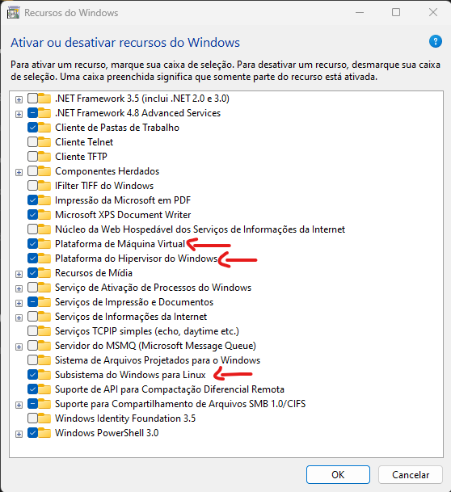

# WSL - Windows Subsystem for Linux

    

# Sobre

O WSL é um recurso para windows que permite executar binários e scripts em Linux diretamente no Windows, basicamente, seria rodar o linux dentro do windows.

Ele é uma boa alternativa pra quem não quer fazer dual boot com o linux ou que não quer ficar criando um ambiente separado com uma virtual machine, ou também pra poder rodar algo que não conseguiu instalar no windows por exemplo.

Atualmete ele está na sua segunda versão, que está sendo até que bem recebido em comparação à primeira versão.

# Preparação do ambiente

Para poder usar o WSL, você precisa habilitar a virtualização no seu pc, seja com o AMD-V ou com o Intel VT-x, que precisa ser feito pela bios.

### Intel VT-x

Para entrar na bios, vai depender de cada computador/placa mãe, mas após entrar na bios, você vai em `ADVANCED`, nessa aba vai ter a opção `Inter Virtualization Technology` é só colocar como `Enabled` após isso, salvar e sair.

Exemplo:

### AMD-V

Para entrar na bios, vai depender de cada computador/placa mãe, mas após entrar na bios, você vai em `ADVANCED`, estando em `ADVANCED`, você vai na opção `CPU Configuration`, estando nela você vai ter a opção `SVM Mode` aí é só colocar como `Enabled` após isso, salvar e sair.

Exemplo:

### Ativar recurso de virtualização no Windows

Alguns computadores vem com a opção de virtualização desativada no Windows, com isso, é importante verificar se esta funcionalidade está ativada nas configurações do sistema operacional para que o WLS funcione corretamente.

Para isso, no menu iniciar do Windows, pesquise por **Ativar ou desativar recursos do Windows,** e verifique se os seguintes recursos estão ativos:

Caso um deles não esteja marcado, ative-o e clique em Ok. Em seguida, reinicie o Windows para que as alterações sejam aplicadas.

# Instalando o WSL

Primeiro, iremos abrir o powershell como administrador e executar o seguinte codigo:

`dism.exe /online /enable-feature /featurename:Microsoft-Windows-Subsystem-Linux /all /norestart`

Após isso, você irá reiniciar o computador e o WSL 1 estará instalado.  
Atualmente, já existe uma versão atualizada do WSL, o WSL 2. Ela possui muitas melhorias e seu uso é recomendado. [Clique aqui](https://docs.microsoft.com/pt-br/windows/wsl/compare-versions) e veja a comparação entre as versões.
Entretanto, é necessário que o seu Windows 10 esteja na versão **2004**, **Build 19041** ou superiores.  
Para poder utilizar a **interface gráfica** das distribuições do Linux no Windows, o **WSL 2** é necessário.

## Atualizando para o WSL 2

Tendo reiniciado o computador, iremos ativar o recurso "Plataforma de Máquina Virtual".

Para isso, abra o Powershell como Administrador e execute a seguinte linha de código e reinicie o computador em seguida:

`dism.exe /online /enable-feature /featurename:VirtualMachinePlatform /all /norestart`

Após a reinicialização ter sido concluída, execute a linha de código abaixo no Powershell como Administrador:

`wsl --set-default-version 2`

Se aparecer a mensagem `WSL 2 requires an update to its kernel component.` ou se o sistema estiver em português `WSL 2 requer uma atualização para seu componente kernel.` depois de ter executado o comando anterior, é recomendado que acesse esse [link](ttps://docs.microsoft.com/pt-br/windows/wsl/install-win10) caso tenha alguma duvida, ou pode ir diretamente para esse [link](https://wslstorestorage.blob.core.windows.net/wslblob/wsl_update_x64.msi) para fazer o download do pacote de atualizações que se pede

Assim, quando uma nova distribuição for instalada, será utilizada a versão 2 e não a primeira.

## Instalação simplificada (Windowns Insider)

Se você fazer parte do programa Windows Insider, pode ser que é disponivel usar o comando `wsl --install` ou `wsl.exe --install`. Com ele é executado as seguintes ações:

- Habilita os componentes opcionais WSL e Plataforma de Máquina Virtual
- Baixa e instala o kernel do Linux mais recente
- Define WSL 2 como o padrão
- Faz download e instala uma distribuição do Linux (talvez seja necessário fazer a reinicialização)

Um aviso importante: por padrão, o Ubuntu é a distribuição instalada. Mas caso queira usar outro, você pode alterar usando `wsl --install -d NomeDaDistribuição`, e você pode rodar o comando `wsl --list --online` para ver a lista de distribuições disponiveis.

# Instalando a Distribuição Linux

Para a gente instalar uma distribuição, abra a Microsoft Store e pesquise por "linux", ou acesse o [link](https://aka.ms/wslstore) para exibir as versões disponiveis.

Selecione distribuição de sua escolha e faça a instalação, sem muito segredo. Estando instalado, execute e aguarde alguns minutos, a tela que foi aberta pedirá a você colocar um **nome de usuário** e **senha**. Feito isso, você já pode usar o terminal do linux normalmente.

Caso você tenha instalado o WSL pra aprender Linux ainda, na he4rt temos o [linux4noobs](https://github.com/lucashe4rt/linux4noobs) que vai te ajudar nessa jornada no mundo linux.
